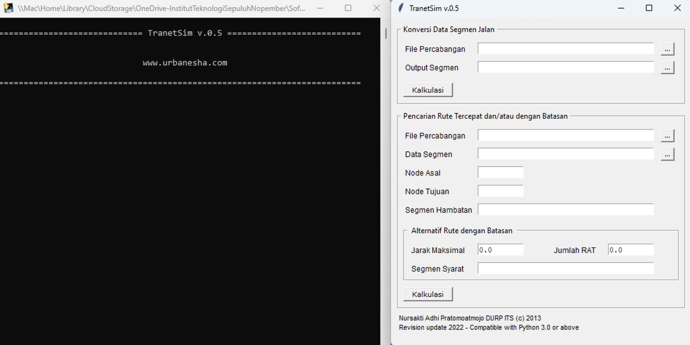

## Download
You can download the latest version of TranetSim using the link below:

- [**TranetSim v0.5**](https://www.mediafire.com/file/25tykxizvd10w3w/TranetSim_v.0.5.zip/file)

## System Requirements
To ensure optimal performance, please make sure your system meets the following minimum specifications:

- **Operating System:** Windows 7, 8, 10, or 11 (32-bit or 64-bit)
- **Processor:** Dual-core 2.0 GHz or faster  
- **Memory:** Minimum 512 MB RAM (2 GB recommended)  
- **Storage:** At least 30 MB of free disk space

## How to Run
!!! info "No Installation Required"
    TranetSim is a fully portable application—no installation is needed.
To run the application:

1. Ensure your device is connected to the internet.
2. Extract the downloaded `TranetSim_v.0.5.zip` file.
3. Locate the executable icon 💾 `TranetSim_for_Windows (2.6 MB)`.
4. Right-click the file and select **Run as Administrator**.
!!! warning "Windows Security Notice"
    If Windows Defender displays a "Windows protected your PC" warning, click **More info** → **Run anyway** to proceed.

After opened, TranetSim have simple user interface and console 

