EXPERIMENTAL WORK TRIP ASSIGNMENT

!!! info "Data Preparation"
    Beberapa hal yang perlu diperhatikan pada saat persiapan data TRANETSIM:

    1. Tiap segmen/link (potongan ruas jalan) hanya dapat merepresentasikan satu jalur (satu arah pergerakan)

    2. Tiap segmen memerlukan satu nilai yang digunakan untuk perhitungan. Apabila banyak hal yang diperlukan untuk menghasilkan nilai tersebut, maka proses tersebut dianjurkan dilakukan di proses lain sebelum ditetapkan sebagai data TRANETSIM.

1. Gambarlah model jaringan jalan secara **Schematics** - menggunakan software seperti GIS Software (ArcGIS / QGIS) atau Design Software (Figma / PowerPoint). Gambar ini digunakan sebagai acuan maupun visualisasi terhadap hasil pengolahan.
    - Link  
    - Nodes 
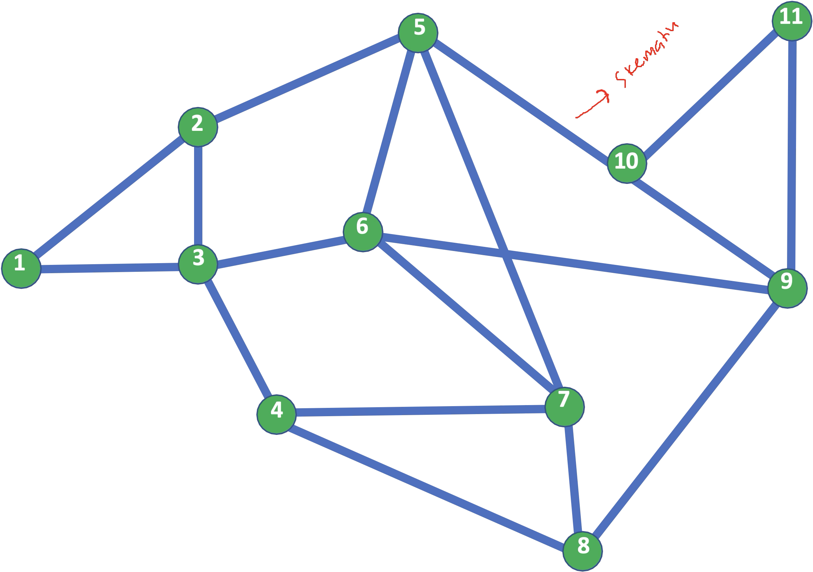

2. Tambahkan informasi mengenai **Impedances** (jarak, waktu tempuh, biaya, dlsb) pada masing-masing Link. Nilai tersebut juga bisa diberikan scoring melalui AHP/ANP.
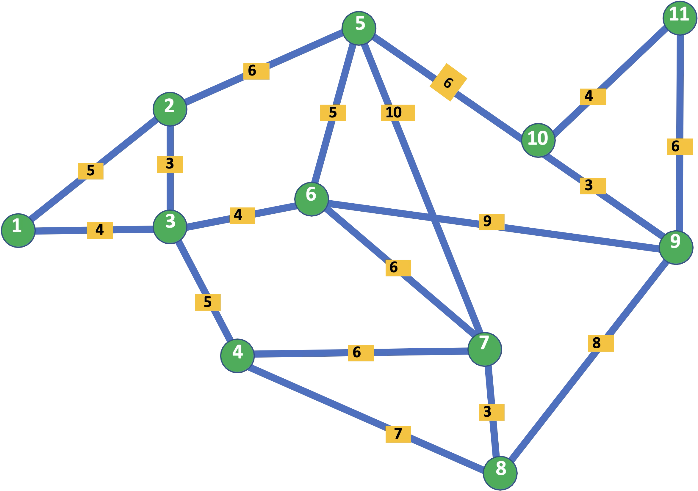

3. Tambahkan informasi mengenai **Arah** (one-way, two-way) pada masing-masing Link
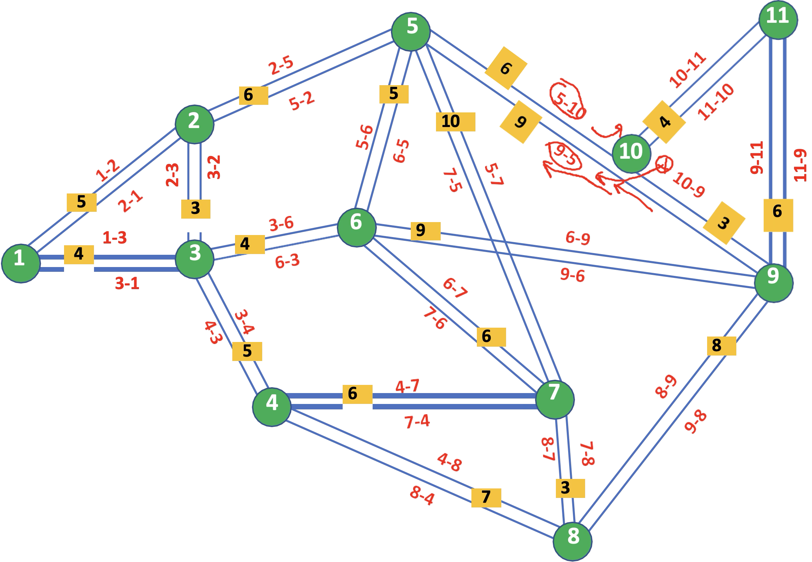

4. Buatlah pola jaringan jalan tersebut kedalam Microsoft Excel. 
    - `Point`: menunjukkan Node (Origin - Destination).
    - `Kolom B` (Branch): percabangan dari satu node ke node lain.
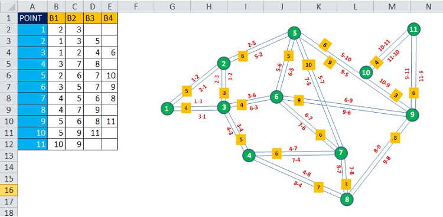
> 📌 **Description:**  
> Pada gambar di atas, pergerakan dari simpul 1 memiliki dua kemungkinan percabangan: menuju simpul 2 dan simpul 3. Sementara itu, simpul 5 menunjukkan percabangan menuju simpul 2, 6, 7, dan 10.

5. Simpan (save as) Data percabangan dengan format `.txt` (Tab Delimited)
    - misal `Data_Percabangan.txt`
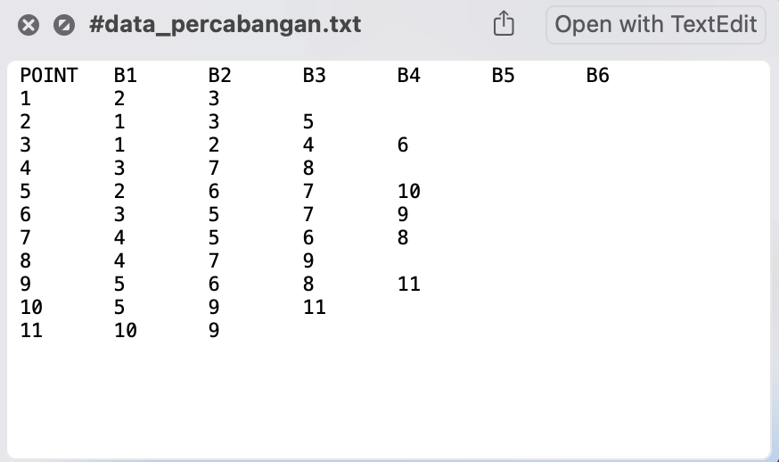

6. Buka aplikasi TranetSim
7. Ubah data tersebut menjadi data percabangan yang siap diolah
    - Masukkan `Data_Percabangan.txt`
    - Cari tempat menyimpan Output Segmen, beri nama misal `Data_Segmen.txt`
    - Kalkulasi
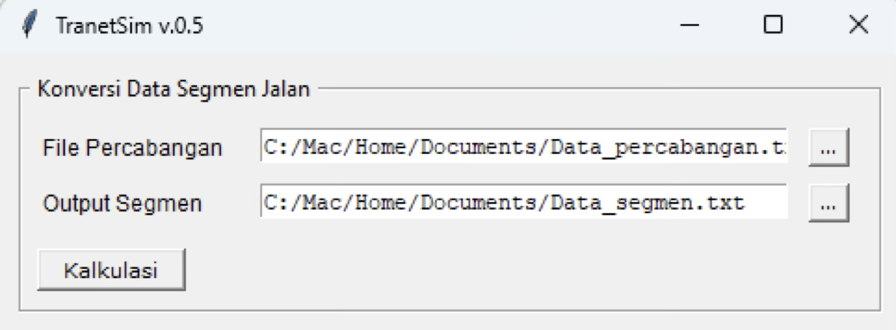

8. Hasilnya adalah file `.txt` dengan list
    - **SEGMENT**: konektivitas jalan
    - **VAR**: tempat memasukkan impedance.
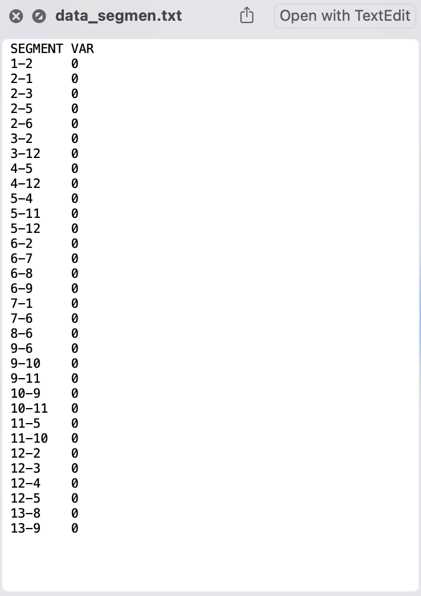
> 📌 **Description:**  
> Nilai 0 pada **VAR** harus diganti dengan nilai impedance (jarak, waktu tempuh, dlsb) pada tiap segmen. Gunakan titik `.` untuk merepresentasikan angka desimal. Mengubah nilai VAR bisa dilakukan di notepad langsung atau melalui Excel kemudian di export lagi ke `.txt`
    - Contoh hasil data_segment.txt yang sudah di isi dengan nilai impedances (jarak)
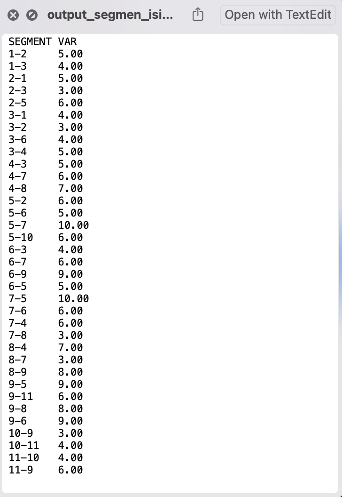
> 📌 **Description:**  
> Nilai **VAR** semakin kecil semakin potensi dilalui

9. Kembali ke TranetSim → pada framework **Pencarian Rute Tercepat**
    - Masukkan `Data_Percabangan.txt` pada kolom File Percabangan
    - Masukkan `Data_Segmen_Isi.txt` yang telah diisi data impedance (jarak).
    - Masukkan Node Asal - Node Tujuan (misal dari 1 - 10)
    - Kalkulasi
    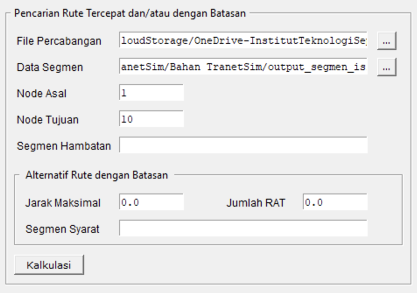
    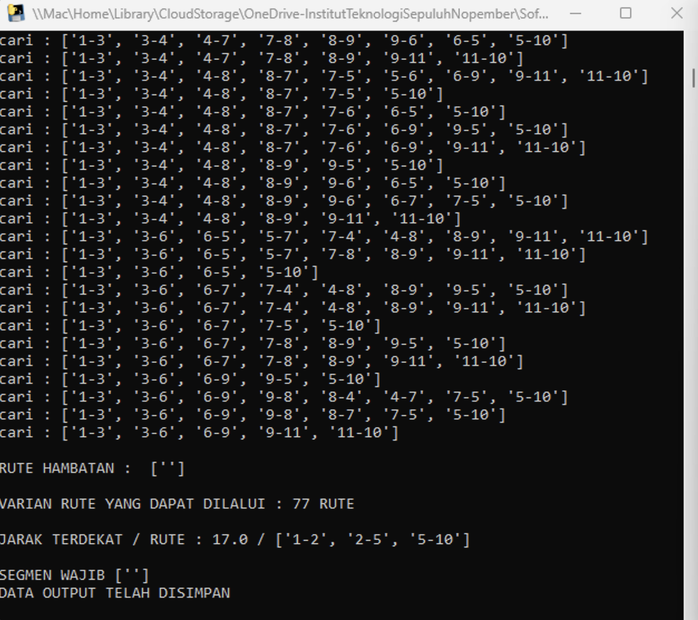
> 📌 **Description:**  
> Mekanisme kalkulasi akan mencari rute tercepat dari kedua simpul tersebut Node Asal menuju Node Tujuan. TranetSim akan mencari rute terpendek berdasarkan data jarak yang dijadikan sebagai input.

10. Simulasi dengan **hambatan**
    - Isi kolom `Hambatan Segmen` dengan segmen yang menjadi hambatan pada rute tersebut. Misal jalan antara simpul 5 dan 10 hanya mengijinkan pergerakan satu arah dari 10 → 5 (arah 5 → 10 ditutup), maka isilah kolom hambatan segmen dengan 5-10. 
    - Kalkulasi
    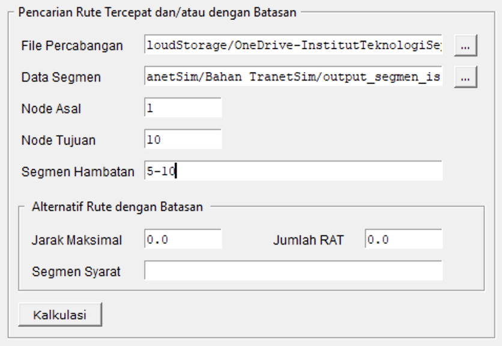
    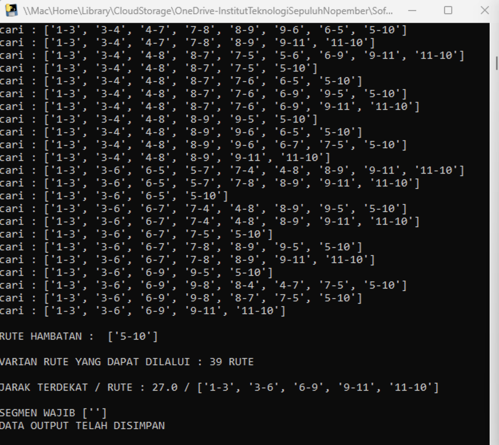
> 📌 **Description:**  
> - Apabila hambatan yang ingin dimasukkan lebih dari satu, maka isi dengan beberapa segmen sekaligus dengan dipisahkan koma (,) tanpa spasi contoh: 3-6,4-7,5-10 (yang berarti tidak ada pergerakan dari 3 → 6, 4 → 7, 5 → 10).  
> - Simulasi yang dilakukan akan mencari rute terpendek berdasarkan Node Asal menuju Node Tujuan dengan mempertimbangkan hambatan-hambatan yang diberikan.

11.	Simulasi **Alternatif Rute dengan Batasan**
    - Jarak maksimal: jarak tempuh maksimum yang ingin di buat rutenya
    - Jumlah RAT (Rencana Asal Tujuan): memilah berapa rute yang perlu di hasilkan
    - Segmen Syarat: ruas yang harus dilalui
    - Kalkulasi
    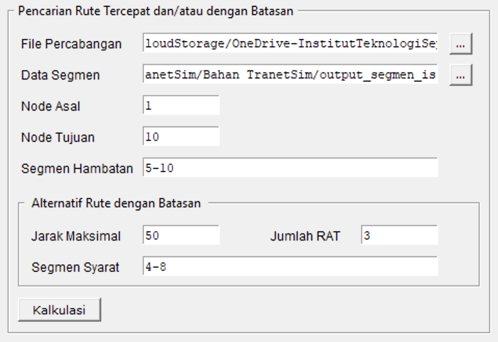
    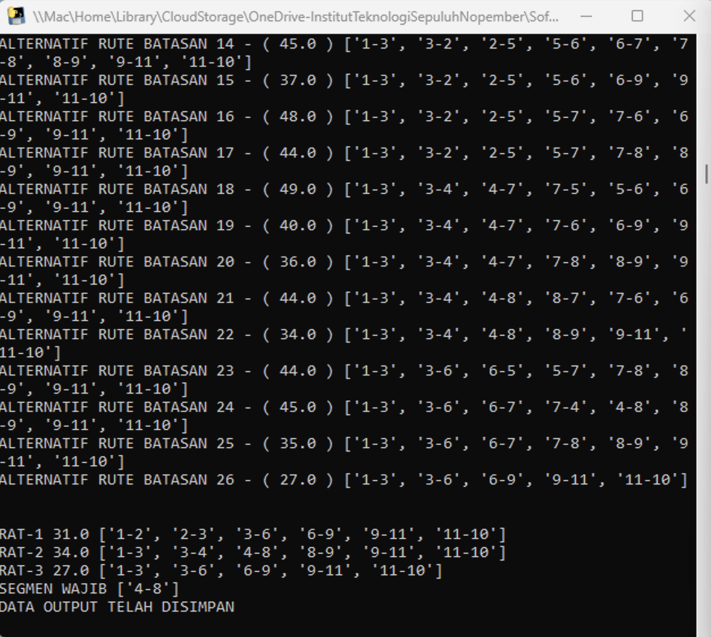

!!! info "Output"
    - File `.txt` hasil kalkulasi disimpan satu directory dengan software **TranetSim**.
    - Console TranetSim akan menunjukkan alternatif rute yang memungkinkan dengan mempertimbangkan hambatan yang diberikan. Selain itu, console TranetSim akan menunjukkan rute terpendek beserta nilai minimal (dalam kasus ini adalah jarak minimal).

## Lampiran

=== "Data Percabangan"

    | POINT | B1 | B2 | B3 | B4 |
    |-------|----|----|----|----|
    |   1   |  2 |  3 |    |    |
    |   2   |  1 |  3 |  5 |    |
    |   3   |  1 |  2 |  4 |  6 |
    |   4   |  3 |  7 |  8 |    |
    |   5   |  2 |  6 |  7 | 10 |
    |   6   |  3 |  5 |  7 |  9 |
    |   7   |  4 |  5 |  6 |  8 |
    |   8   |  4 |  7 |  9 |    |
    |   9   |  5 |  6 |  8 | 11 |
    |  10   |  5 |  9 | 11 |    |
    |  11   | 10 |  9 |    |    |

=== "Data Segmen"
    | SEGMENT | VAR  |
    |---------|------|
    | 1-2     | 5.00 |
    | 1-3     | 4.00 |
    | 2-1     | 5.00 |
    | 2-3     | 3.00 |
    | 2-5     | 6.00 |
    | 3-1     | 4.00 |
    | 3-2     | 3.00 |
    | 3-6     | 4.00 |
    | 3-4     | 5.00 |
    | 4-3     | 5.00 |
    | 4-7     | 6.00 |
    | 4-8     | 7.00 |
    | 5-2     | 6.00 |
    | 5-6     | 5.00 |
    | 5-7     | 10.00 |
    | 5-10    | 6.00 |
    | 6-3     | 4.00 |
    | 6-7     | 6.00 |
    | 6-9     | 9.00 |
    | 6-5     | 5.00 |
    | 7-5     | 10.00 |
    | 7-6     | 6.00 |
    | 7-4     | 6.00 |
    | 7-8     | 3.00 |
    | 8-4     | 7.00 |
    | 8-7     | 3.00 |
    | 8-9     | 8.00 |
    | 9-5     | 9.00 |
    | 9-11    | 6.00 |
    | 9-8     | 8.00 |
    | 9-6     | 9.00 |
    | 10-9    | 3.00 |
    | 10-11   | 4.00 |
    | 11-10   | 4.00 |
    | 11-9    | 6.00 |